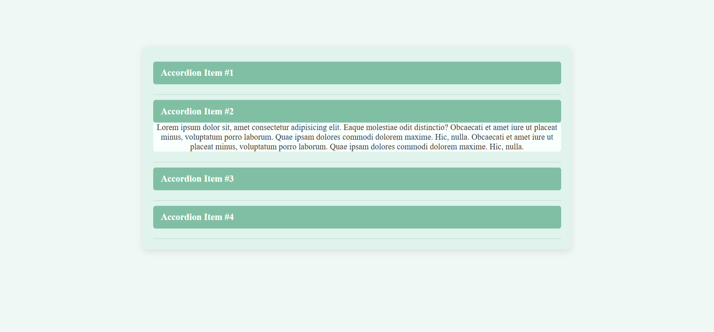

# Accordion Menu Project

This project demonstrates a responsive and animated **Accordion Menu** built with **HTML, CSS, and JavaScript**.

## 💡 Features

- Toggle open/close content by clicking headers
- Only one section opens at a time (auto-collapse)
- Smooth transition animation using JavaScript
- Custom height calculation using `data-h` 
- Styled with a jade green color palette

## 📁 Technologies Used

- HTML5
- CSS3 
- JavaScript

yourusername/your-repo-name.git
